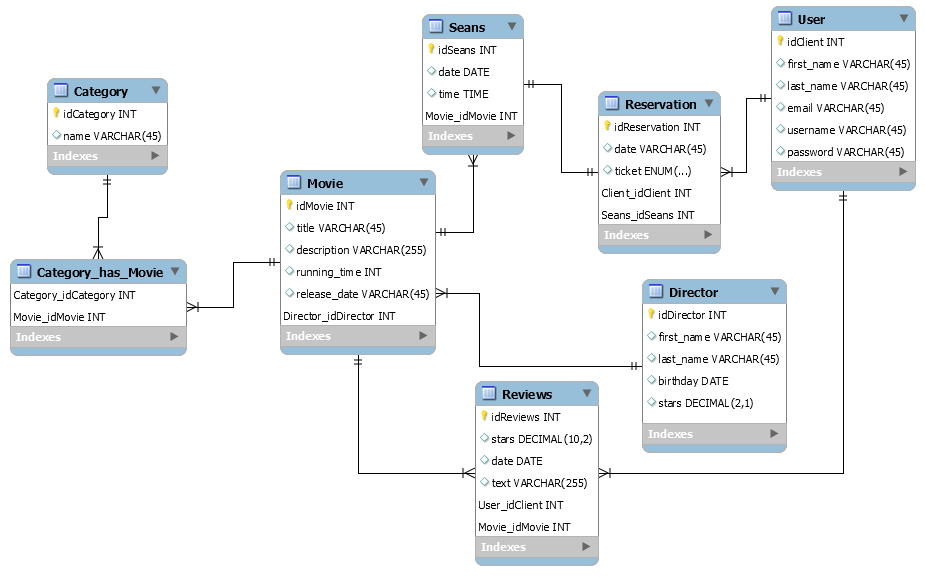

## Projekt - Rezerwacja biletów do kina

### Autor:
  Cholipski Kamil  
  Numer indeksu: 145727

### Wersja Python 3.8.6 

### Użyte biblioteki:
- django 3.1.3
- djangorestframework 3.12.2
- django-filter 2.4.0
- Pytest 6.2.1
- Faker 5.6.5

Baza postawiona na lokalnym serwerze MySQL

### Schemat bazy danych projektu

